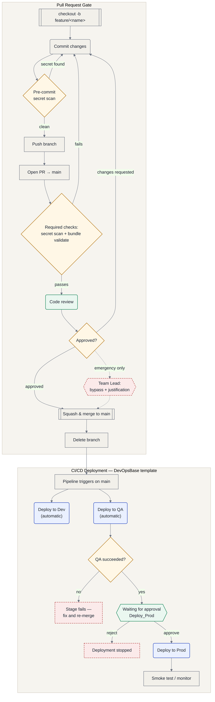

# Workflow Flowchart — Branch to Production

Visual companion to [`GIT-WORKFLOW-GUIDE.md`](GIT-WORKFLOW-GUIDE.md) and [`ADO-CICD-Adoption-Plan.md`](ADO-CICD-Adoption-Plan.md). Renders natively in the Azure DevOps wiki and on GitHub.

## Legend

| Shape | Meaning |
|---|---|
| Rounded box (blue) | Automatic pipeline stage — no human action |
| Diamond (amber) | Automated decision / gate check |
| Hexagon (green) | Human approval required |
| Rectangle (grey) | Git or local developer action |
| Dashed / red | Exception path — bypass, rejection, or failure |

## Reading it

- **Pull Request Gate** — a developer's change never reaches `main` without passing both the automated secret scan / bundle validation *and* a human reviewer, except through the dashed **bypass** path, which is restricted to the Team Lead and requires a documented justification (see [`GIT-WORKFLOW-GUIDE.md`](GIT-WORKFLOW-GUIDE.md) step 10).
- **CI/CD Deployment** — Dev and QA deploy **in parallel**; QA is not gated on Dev succeeding first. Production is gated on two independent conditions: QA must have succeeded, *and* a configured approver must sign off on the paused `Deploy_Prod` stage (see [`ADO-CICD-Adoption-Plan.md`](ADO-CICD-Adoption-Plan.md) section 5 and [`PLACEHOLDER-SETUP-GUIDE.md`](PLACEHOLDER-SETUP-GUIDE.md) #5).
